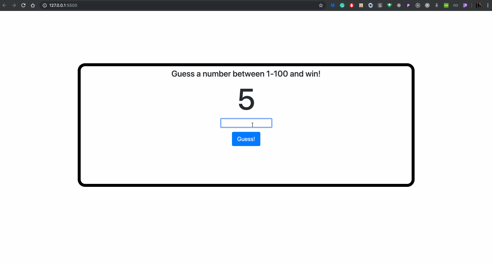

# CoderSchool FTW -  Number Guessing Game

Created with love by: Loi Tran

A game built using HTML, CSS, and JS. The game asks the user to guess a number between 1-100. The user has 5 guesses to guess correctly!

## Try it out

Demo online at [this link.](https://festive-thompson-5eeb3f.netlify.com/)

## Video Walkthrough

## User Stories

The following **functionalities** are completed:

* [x] User is prompted to play the game
* [x] User starts game with 5 guesses
* [x] User can guess a number using an input.
* [x] When the user guesses the input is cleared.
* [x] User's guesses are limited to 5
* [x] User's guess is compared to a randomly generated value between 1-100
* [x] If the user guess is higher than the randomly generated value, the user is prompted accordingly
* [x] If the user guess is lower than the randomly generated value, the user is prompted accordingly
* [x] User can reset the game if they run out of guesses
* [x] If user guesses correctly, the game is automatically reset
* [x] Colors are used to help the user understand the state of their game.

## Time Spent and Lessons Learned

Time spent: **3** hours spent in total.

I leanred how to use HTML, CSS, Bootstrap, and JS together to add structure, styling, beautiful, and complicated behavior to a web application.

## License

    Copyright [2019] [Loi Tran]

    Licensed under the Apache License, Version 2.0 (the "License");
    you may not use this file except in compliance with the License.
    You may obtain a copy of the License at

        http://www.apache.org/licenses/LICENSE-2.0

    Unless required by applicable law or agreed to in writing, software
    distributed under the License is distributed on an "AS IS" BASIS,
    WITHOUT WARRANTIES OR CONDITIONS OF ANY KIND, either express or implied.
    See the License for the specific language governing permissions and
    limitations under the License.

